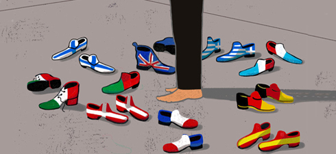

## Glocalization in healthcare
 
* Globalization + Localization  

* Describes the adaptation of global products or services to accommodate the needs of people in a specific locale^1^  

* How to accomodate products or services if you don't understand your market?  
  

## Health at a Glance
Every 2 years, since 2001,the OECD (Organisation for Economic Co-operation and Development) publishes a report called "Health at a Glance". 

It provides the latest comparable data and trends on different aspects of the performance of health systems in OECD countries.

## Healthcare Explorer

* 12 Healthcare data sources from OECD

## Outcomes (1)
**General Practicioners Salaried:**  

* Slovak Rep. and Finland have similar remmuneration but Slovak Rep. has 4 times more consultations  

* Hungary - has the lowest remmuneration and the max number of consultations per day  

* Denmark - has the highest remmuneration and one of the lowest number of consultations   
  
**GP Self-employed:** Tend to be give the same number of consultations. Pharma industry (i.e. marketing)  

##Outcomes (2)
###Japan  
Appears to have a robust HC system, with big populaiton and high life exptancy rates.It has the highest number of medical devices and number of beds and the longest stays in hospitals.  

However this also shows how Japan's healthcare system sustainabilty is in question^2^.

##Outcomes (3)
###Austria (2012)  

The hospital stay lenght, number of beds, MRI and CT units and its %GDP show a solid HC system.

Number of CT and MRI exams and units are above the average. Review maintenance contracts and EOL equipment as an strategy. 

##Outcomes (4)

###Mexico: 
Focus on HC key opinion leaders and students to increase brand prefence. 

###Estonia and Turkey:
Could have marketing strategy of refurbished systems.  
They have low %GDP and Estonia's number of exams show a fast growth.  
Turkey also shows an increase in doctors and nurses, which could be related to the population growth.

##Outcomes (5)
###Iceland & Luxemburg:  
Number of examns are above the average. However, number of devices does not show the same growth. 
 
Strategy: use model of charge per exam, plus attractive maitenance contracts. 

##Outcomes (6)

###Spain:
Considerable decrease in doctor graduates, even when there is a considerable growth in total number of doctors and nurses. 

###UK: 
Noticeable increase in MRI exams and also in CT units. Strong GDP%, low MRI and CT units compare to the population size. Good opportunity to place new equipment. 

##Outcomes (7)

* The increase in medical devices and exams was expected

* Where are all the graduated nurses and doctors are? HC migration?

## Future work

* Collect more data of remuneration per year. 
* Include more data sources from OECD database 
* Include market trends from COCIR. 

##References 

1. Deloitte, "2014 Global health care outlook Shared challenges,shared opportunities" 
https://www2.deloitte.com/content/dam/Deloitte/global/Documents/Life-Sciences-Health-Care/dttl-lshc-2014-global-health-care-sector-report.pdf

2. McKinsey
"Improving Japan's health care system"
http://www.mckinsey.com/insights/health_systems_and_services/improving_japans_health_care_system

 
