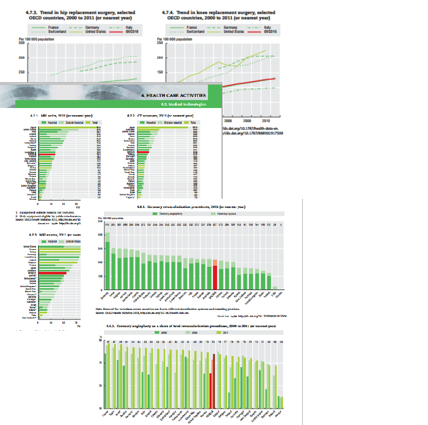

## Introduction
Every 2 years, since 2001,the OECD (Organisation for Economic Co-operation and Development) publishes a report called "Health at a Glance". 

It provides the latest comparable data and trends on different aspects of the performance of health systems in OECD countries.

---

## Glocalization in healthcare
 
* Globalization + Localization  

* Describes the adaptation of global products or services to accommodate the needs of people in a specific locale^1^  

* How to accomodate products or services if you don't understand your market?  
  

##References 

1. Deloitte, "2014 Global health care outlook Shared challenges,shared opportunities" 
https://www2.deloitte.com/content/dam/Deloitte/global/Documents/Life-Sciences-Health-Care/dttl-lshc-2014-global-health-care-sector-report.pdf
 

